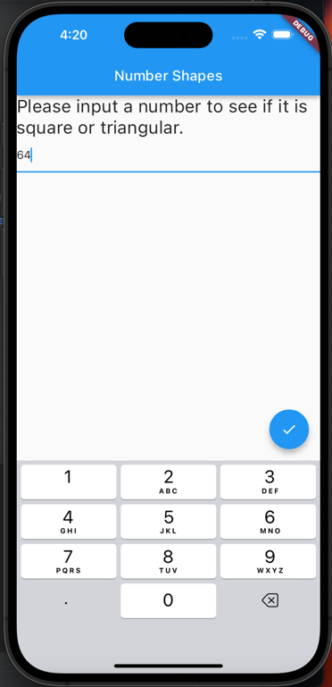
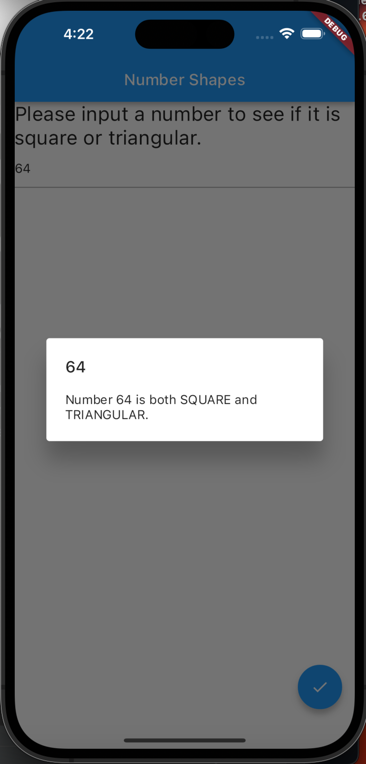

# Flutter Google Digital Labs
## Homework 2 - Check number if i's a square, triangular or both

## Getting Started - UI Presentation

This project contains a text field in which the user inputs a number (**Cannot input anything but numbers**).

After the user inputs the number they can press the floating button in the lower right corner of the screen button to see if the number is squared, triangular or both

